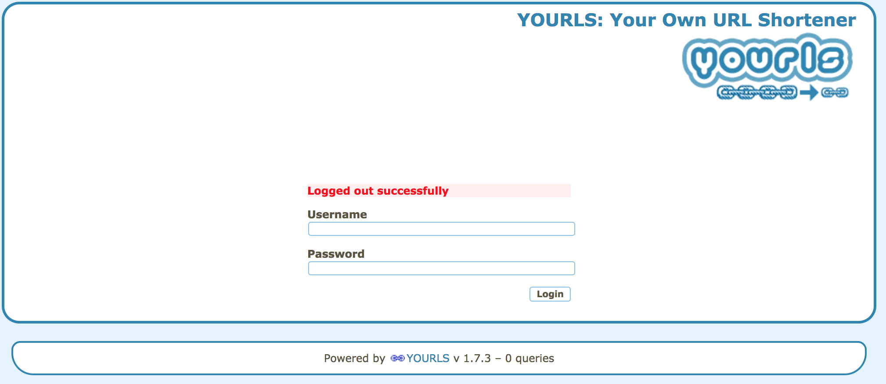
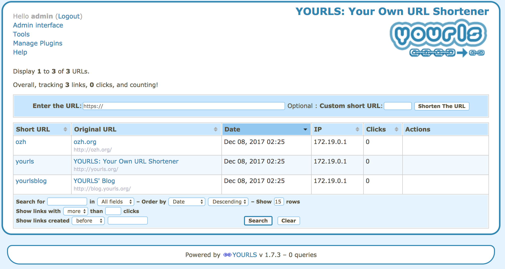
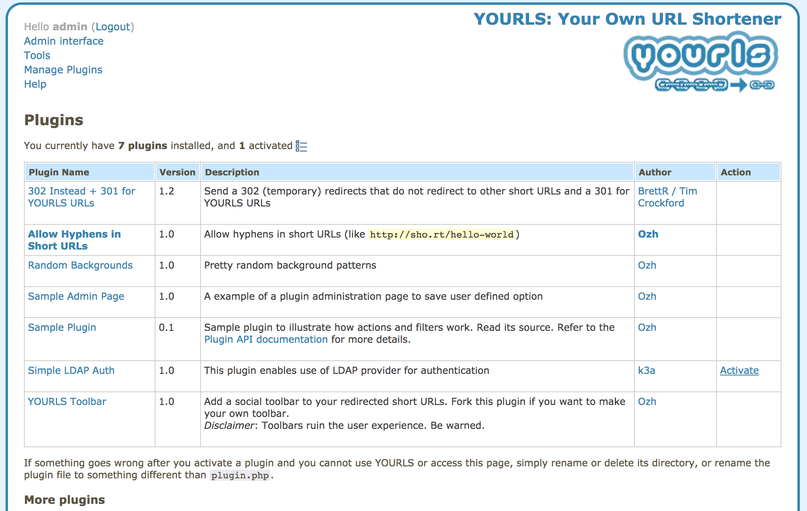
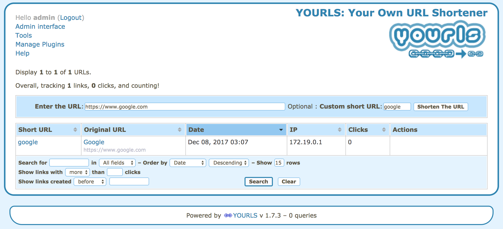

# YOURLS Environment in docker and with Ldap integration

## Motivation

Always when you have to use some tool, you need to do the whole installation process, setup database, and change something inside the code and etc. That process is so boring and, sometimes, complex that I don't know how to express my feeling about it.

Because of that, I decide to create this simple process to help people who wants to use a shortener tool.

All of this proccess was created using the opensource called [YOURLS - Your Own URL Shortener](https://yourls.org/), which is a very powerful tool, and Docker + Docker Compose to make it easy to manage and move to wherever you want.

There are many [plugins](https://github.com/YOURLS/awesome-yourls) developed by the community and they seems to be very active maintaining those codes.

## Development and Production environment

I have created a very interesting way to run the whole environment in your computer or server using docker.

All of theses proccess are based on `make` command using the file `Makefile`.

The next, you'll see the instructions to manipulate the environment.

### Prereqs

  - Docker and docker-compose installed on your computer (https://docs.docker.com/engine/installation/)

### Before Start

* **Step 1:** Rename `.env_example` to `.env`.
* **Step 2:** You must configure the .env file which will be read by docker.


```
# .env_example file

# Database configurations                                                                                                                                     
MYSQL_USER=root
MYSQL_ROOT_PASSWORD=passwd
MYSQL_DATABASE=yourls
MYSQL_DB_HOST=db

# App configuration
YOURLS_SITE=http://shorte.ner
ADMIN_PASSWORD=passwd
YOURLS_UNIQUE_URLS=false

# Ldap Configuration
LDAPAUTH_HOST=ldap://LDAP_ADDRESS
LDAPAUTH_PORT=389
LDAPAUTH_BASE=OU=USERS,DC=example,DC=com
LDAPAUTH_USERNAME_FIELD=sAMAccountName
LDAPAUTH_SEARCH_USER=user_admin@example.com
LDAPAUTH_SEARCH_PASS=passwd_user_admin
LDAPAUTH_BIND_WITH_USER_TEMPLATE=%s@example.com
LDAPAUTH_GROUP_REQ=CN=GROUP1,OU=GROUPS,DC=example,DC=com
LDAPAUTH_GROUP_ATTR=memberof
LDAPAUTH_USERCACHE_TYPE=0
```

### Starting

The first command you'll have to run is `make build`.
This command will create the whole environment in your computer using docker. 

```
make build:     Create new development environment
make start:     Start development environment previously created
make stop:      Stop development environment
make status:    Show development environment
make restart:   Restart development environment
make clean:     Clean dangling volume and images from docker
make help:      How to use make command
```

### Explaining Parameters

* **make build:** When you want to create the environment executing again process such: migrate, deps install, requirements install, etc...;
* **make start:** Just start the whole environment without change. This command does not execute the steps above;
* **make stop:** As clear as water... To stop the environment;
* **make status:** Another clear... Show environment status;
* **make restart:** Do not need explanation;
* **make clean:** Very important to clean you computer removing dangling volumes and images from docker;

### Accessing the environment

After the environment started, you can access by using the URL `http://localhost` on your browser. If you are using on production, just use the server IP instead of `localhost`

## Activating Ldap plugin

Enter on system with `admin` user and password (the same you've defined in the .env file), go to the `Manage Plugins` and enable `Simple LDAP Auth`. 

After that, all of those LDAP informations you've defined in .env will be respected.

**Login Page:**



**Dashboard:**



**Plugins:**



## Shortening the URL

Just fill the fields `Enter the URL`, with the target which you want and, `Custom short URL`, with the `PATH` for your domain (YOURLS_SITE in .env file).

With the configuration below, you're gonna redirect your site `http://MY_SITE.com/google` to `https://www.google.com`


